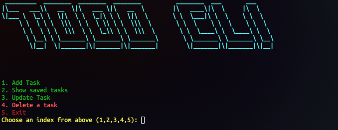

# Mini CLI To-Do Application

This is a simple Command Line Interface (CLI) to-do application built using Node.js. It allows users to add, list, update and remove tasks directly from the terminal.

## Features
- Add tasks to the to-do list
- View all tasks in table-format (you might need to zoom out if the your terminal font is too large)
- Update the pending status
- Remove completed tasks

## Prerequisites
Make sure you have the following installed on your system:
- [Node.js](https://nodejs.org/)
- npm (comes with Node.js)
- [Git](https://git-scm.com/downloads) (Just for cloning the repo)

## Installation (One-Time)
1. Open your terminal (powershell in case of windows)
2. Clone this repository:
   ```sh
   git clone https://github.com/Xranus/todo-cli
   ```
3. Navigate to the `todo-cli` folder through the terminal
   ```sh
   cd todo-cli
   ```
4. Install dependencies:
   ```sh
   npm install
   ```

## Usage
Run the application using Node.js (make sure are inside the `todo-cli` folder):
```sh
node index.js
```

### Commands:
- **Add a task:** Follow the on-screen prompt to enter a new task.
- **View tasks:** The application will list all tasks in a table format.
- **Update a task** You can either update the task description or it's pending status
- **Remove a task:** You can remove completed tasks from the list.

## Screenshot


## Contributing
This is a beginner-friendly project (My first ngl). Feel free to fork and improve it!


