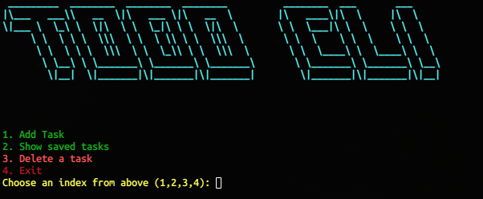
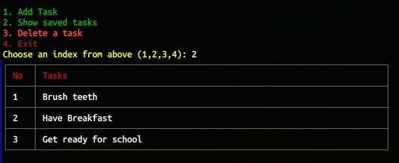

# CLI To-Do Application

A simple command-line to-do application built with Node.js. This is my first-ever Node.js project!

## Features
- Add tasks
- View saved tasks
- Delete saved tasks when completed
- Simple and easy-to-use CLI interface

## Screenshot


## Installation
1. Clone the repository:
   ```sh
   git clone https://github.com/Xranus/todo-cli
   cd cli-todo
   ```
2. Install dependencies:
   ```sh
   npm install
   ```

## Usage
Run the application with:
```sh
node index.js
```
Follow the on-screen prompts to add and view tasks.


---
Feel free to contribute and improve this project!


